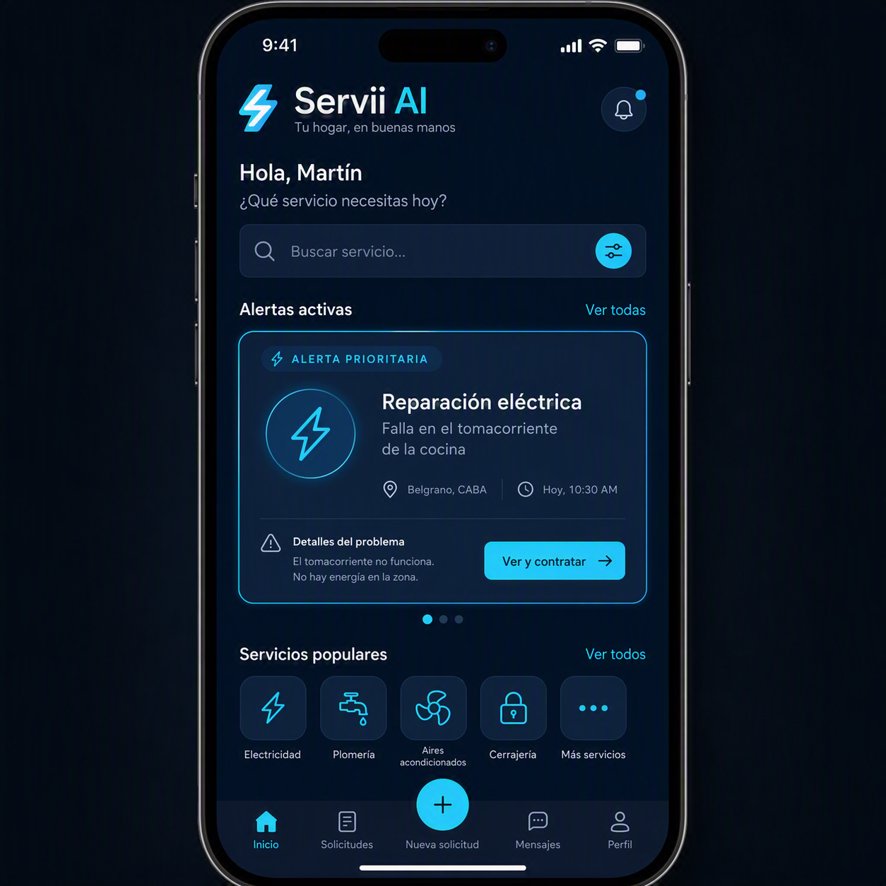

# 🛠️ Servii AI - Copiloto Inteligente para Servicios del Hogar

## 1. Resumen
**Servii AI** es una Prueba de Concepto (POC) que busca digitalizar y estandarizar la contratación de servicios de mantenimiento del hogar en Uruguay. Utilizando técnicas de *Fast Prompting* e Inteligencia Artificial Generativa, la plataforma procesa descripciones informales de los usuarios y devuelve Fichas Técnicas estructuradas. Esto elimina la necesidad de visitas presenciales de diagnóstico, ahorrando tiempo y dinero tanto a clientes como a profesionales.

## 2. Introducción
* **Nombre del proyecto:** Servii AI.
* **Presentación del problema:** Existe una gran fricción e informalidad al contratar servicios del hogar (el 43,1% del sector es informal según el INE). Los usuarios describen problemas de forma vaga, obligando a los técnicos a cotizar "a ciegas" o hacer visitas previas no remuneradas.
* **Desarrollo de la propuesta de solución:** Un "Director Técnico Virtual" impulsado por LLMs que traduce la solicitud del usuario en un diagnóstico estructurado (rubro, urgencia, materiales). Se utilizan modelos de texto-texto para el motor lógico y modelos texto-imagen para conceptualizar la plataforma.
* **Justificación de la viabilidad:** El proyecto es técnica y financieramente viable. Utilizando *Fast Prompting* se minimiza el uso de *tokens*, logrando que cada diagnóstico cueste fracciones de centavo de dólar mediante la API de Gemini, un costo marginal frente al valor de intermediar un servicio real.

## 3. Objetivos
* Desarrollar una POC funcional en Python que automatice diagnósticos técnicos.
* Estandarizar solicitudes informales en esquemas estructurados comprensibles para los trabajadores.
* Optimizar los costos de API limitando parámetros de salida y evitando flujos conversacionales innecesarios.

## 4. Metodología
Se implementó un flujo de un solo paso (*Zero-Shot*) mediante un script en Python (Jupyter Notebook) que consume la API REST de Google Gemini. El código busca dinámicamente el modelo compatible en la cuenta del usuario, inyecta el problema doméstico en un *System Prompt* restrictivo, y devuelve la respuesta en una única llamada para maximizar rentabilidad.

## 5. Herramientas y tecnologías
* **Fast Prompting (Zero-Shot con Output Estructurado):** Se priorizó la velocidad y reducción de costos limitando los *max_tokens* y aplicando restricciones severas ("cero charla") para evitar alucinaciones.
* **Google Gemini (API REST):** Seleccionado por su relación velocidad/costo (modelo flash).
* **Nightcafe / DALL-E:** Para la generación texto-imagen del mockup de la interfaz, conceptualizando el producto visualmente sin depender de la API de OpenAI.

## 6. Implementación
El código en Python se encuentra disponible en el archivo `Servii_AI_POC.ipynb` de este repositorio. 

**Implementación de Imagen (Mockup de la UI):**
* **Herramienta:** Nightcafe / DALL-E
* **Prompt utilizado:** *"Una pantalla de celular mostrando la interfaz de una aplicación moderna llamada Servii AI, diseñada para contratar técnicos del hogar. Diseño súper limpio tipo startup, usando azul oscuro y detalles celeste brillante. Alerta de reparación eléctrica con estilo minimalista, iconos claros."*
* **Salida generada:**
 *(Asegúrate de subir tu imagen al repositorio con el nombre mockup.jpg)*

## 7. Resultados
La implementación logra extraer exitosamente la intención del usuario a partir de inputs vagos (ej. *"hace ruido a chispa"*), deduciendo correctamente el oficio requerido (Electricista) y la urgencia (Alta). La técnica de *Fast Prompting* demostró ser efectiva: el modelo jamás se desvió del formato solicitado y mantuvo el consumo de tokens al mínimo establecido, probando que la automatización del diagnóstico es real y rentable.

## 8. Conclusiones
Los objetivos propuestos se cumplieron a cabalidad. Se comprobó que el uso de Inteligencia Artificial Generativa no requiere interfaces conversacionales complejas (chatbots) para ser útil; un prompt estricto y unidireccional (*Fast Prompting*) es suficiente para estructurar datos caóticos y resolver un problema logístico real del mercado uruguayo.